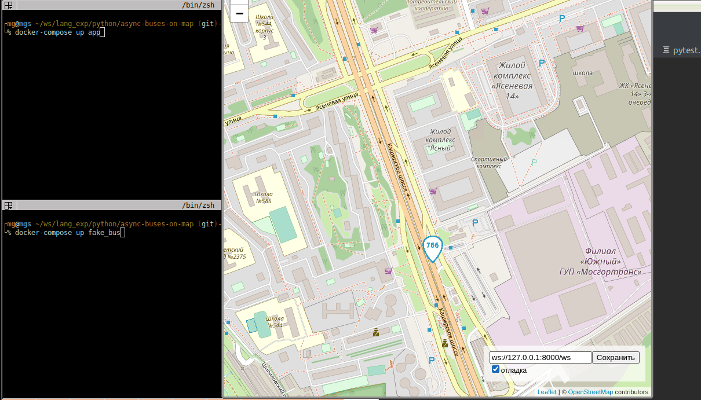

# Автобусы на карте Москвы

Веб-приложение показывает передвижение автобусов на карте Москвы.



## Как запустить

- Скачайте код: `git clone https://github.com/polosaty/async-buses-on-map.git`
- Откройте в браузере файл `index.html`
- Запустите server: `docker-compose up`

## Настройки

### Frontend

Внизу справа на странице можно включить отладочный режим логгирования и указать нестандартный адрес веб-сокета.


Настройки сохраняются в Local Storage браузера и не пропадают после обновления страницы. Чтобы сбросить настройки удалите ключи из Local Storage с помощью Chrome Dev Tools —> Вкладка Application —> Local Storage.

Если что-то работает не так, как ожидалось, то начните с включения отладочного режима логгирования.

### Backend

В `docker-compose.yml` описано 2 сервиса `app` (собственно backend) и `fake_bus` для передачи фейковых данных о перемещении автобусов в `app`.

Команда для запуска отдельно `app`:
```shell
docker-compose up app
```
Для настройки `app` предусмотрены параметры командной строки:
- `--browser_port` - порт для браузера (по умолчанию `8000`) можно также задать через переменную окружения `BROWSER_PORT`
- `--bus_port` - порт для имитатора автобусов (по умолчанию `8080`), можно также задать через переменную окружения `BUS_PORT`
- `-v` или `--verbose` - настройка логирования (максимальный уровень `-vvv` - соответствует `DEBUG`).
Уровень логирования можно также задать через переменную окружения `LOG_LEVEL` (прим. `LOG_LEVEL=WARNING`)

Команда для запуска отдельно `fake_bus`:
```shell
docker-compose up fake_bus
```
или с дополнительными параметрами
```shell
docker-compose run --rm fake_bus python fake_bus.py -vvv \
  --routes_number=100 \
  --buses_per_route=10 \
  --websockets_number=5
```
Для настройки `fake_bus` предусмотрены следующие параметры командной строки:

| Параметр      | Переменная окружения | Значение по умолчанию | Описание |
| ----------- | ----------- | ----------- | ----------- |
| `--server`            | `SERVER_URL` | 'ws://app:8080' | адрес сервера |
| `--routes_number`     | `ROUTES_NUMBER` | 1 | количество маршрутов (не больше чем файлов в директории route) |
| `--buses_per_route`   | `BUSES_PER_ROUTE` | 1 | количество автобусов на каждом маршруте |
| `--websockets_number` | `WEBSOCKETS_NUMBER` | 1 | количество открытых веб-сокетов |
| `--emulator_id`       | `EMULATOR_ID` | пустая строка | префикс к busId на случай запуска нескольких экземпляров имитатора |
| `--refresh_timeout`   | `REFRESH_TIMEOUT` | 1 | задержка в обновлении координат сервера (сек.) |
| `-v`, `--verbose`     | `LOG_LEVEL` | `ERROR` | настройка логирования |


маршруты для генерации можно скачать тут: [routes.zip](https://dvmn.org/filer/canonical/1569857033/341/) и положить в `routes`

## Формат данных

Фронтенд ожидает получить от сервера JSON сообщение со списком автобусов:

```js
{
  "msgType": "Buses",
  "buses": [
    {"busId": "c790сс", "lat": 55.7500, "lng": 37.600, "route": "120"},
    {"busId": "a134aa", "lat": 55.7494, "lng": 37.621, "route": "670к"},
  ]
}
```

Те автобусы, что не попали в список `buses` последнего сообщения от сервера будут удалены с карты.

Фронтенд отслеживает перемещение пользователя по карте и отправляет на сервер новые координаты окна:

```js
{
  "msgType": "newBounds",
  "data": {
    "east_lng": 37.65563964843751,
    "north_lat": 55.77367652953477,
    "south_lat": 55.72628839374007,
    "west_lng": 37.54440307617188,
  },
}
```


## Используемые библиотеки

### Frontend
- [Leaflet](https://leafletjs.com/) — отрисовка карты
- [loglevel](https://www.npmjs.com/package/loglevel) — логгирование

### Backend
- [trio-websocket](https://pypi.org/project/trio-websocket/) — работа с websocket`ами
- [asyncclick](https://pypi.org/project/asyncclick/) — работа с параметрами запуска

## Цели проекта

Код написан в учебных целях — это урок в курсе по Python и веб-разработке на сайте [Devman](https://dvmn.org).
